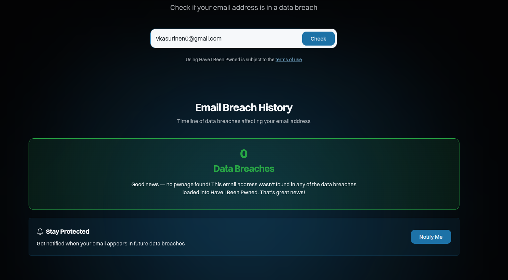

# Task 1: Cybercrime Protection Measures

## Actions Taken to Protect Myself
- Enabled two-factor authentication (2FA) on all important accounts.  
- Used strong, unique passwords stored in a secure password manager.  
- Regularly updated all software, operating systems, and apps to patch vulnerabilities.
- Configured firewalls and monitored network activity on personal servers.
- Using Linux as main operating system

## Experience with Cyber Crimes
- Have not experienced major account breaches or malware infections recently.

## Areas for Improvement
- Increase monitoring of accounts for suspicious activity.  
- Periodically review and update security settings for all online services.  

# Task 2: Company Security Policy

## 1. Password Policy

### Purpose
To ensure all employees use strong, secure passwords to protect company systems, data, and accounts from unauthorized access.  

### Scope
Applies to all employees, contractors, and third-party users who access company systems or accounts.  

### Policy
- Passwords must be at least 12 characters long and include uppercase, lowercase, numbers, and special characters.  
- Do **not** reuse passwords across different systems or accounts.  
- Change passwords every 90 days or immediately if a breach is suspected.  
- Use a company-approved password manager to generate and store passwords securely.  
- Avoid sharing passwords via email, messaging apps, or physical notes.  

### Employee Responsibilities
- Regularly review password strength and update weak passwords.  
- Report any suspected compromise immediately to IT.  
- Enable multi-factor authentication (MFA) on all supported systems.  

### Enforcement
Non-compliance may result in restricted system access and further disciplinary actions.

# Task 3: Threat Modelling

## Task 3A: Threat Dragon – Student Website Threat Model

### System Description
- Static student portfolio website using HTML5 and CSS.  
- Containerized using Docker with Nginx.  
- Hosted on a cloud server rented by the student.  
- Local development connects via SSH.  

### Threat Modelling Steps

#### 1. Identify Assets
- Source code of the portfolio website.  
- Personal data of the student (contact info, portfolio content).  
- Docker container configurations.  
- SSH credentials and server access.  
- Cloud server hosting environment.  

#### 2. Potential Adversaries
- Malicious hackers targeting the server.  
- Automated bots scraping content or attempting brute-force attacks.  
- Insider threats (shared credentials).  
- Malware on local development machine.  

#### 3. Threat Assessment (Likelihood & Impact)
- Server breach via SSH (Likelihood: Medium, Impact: High).  
- Code injection / XSS in portfolio (Likelihood: Low, Impact: Medium).  
- Misconfigured Docker container exposing services (Likelihood: Medium, Impact: High).  
- Leaked credentials (Likelihood: Medium, Impact: High).  
- Website defacement (Likelihood: Low, Impact: Medium).  

#### 4. Cost Evaluation
- Time and effort to implement mitigations are moderate.  
- Budget for security is limited to personal resources.  

#### 5. Mitigation Plan
| Threat | Mitigation | How It Works |
|--------|------------|--------------|
| SSH brute-force | Use strong, unique passwords + disable root login | Prevents unauthorized login attempts |
| Code injection | Sanitize user input / Content Security Policy | Blocks malicious scripts from running |
| Docker misconfig | Limit exposed ports, run containers with least privilege | Reduces

# Task 4B: Account Security – Have I Been Pwned Check

## Account Check
- Checked my primary email address on [Have I Been Pwned](https://haveibeenpwned.com/).  
- Result: **No account details were found in any known data breaches**.  

## Actions Taken
- Although no breaches were found, all important accounts are secured with strong, unique passwords.  
- Multi-factor authentication (MFA) is enabled on all supported services.  
- Regular password audits are scheduled to maintain account security.  

## Screenshot

