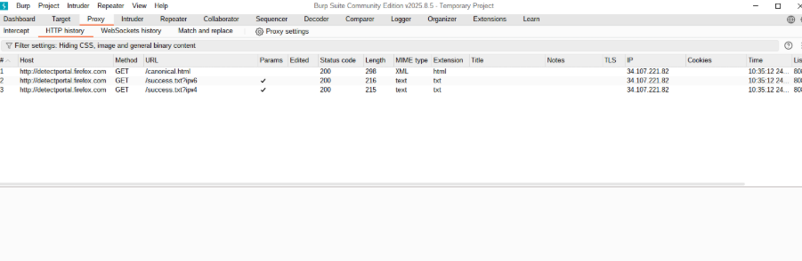
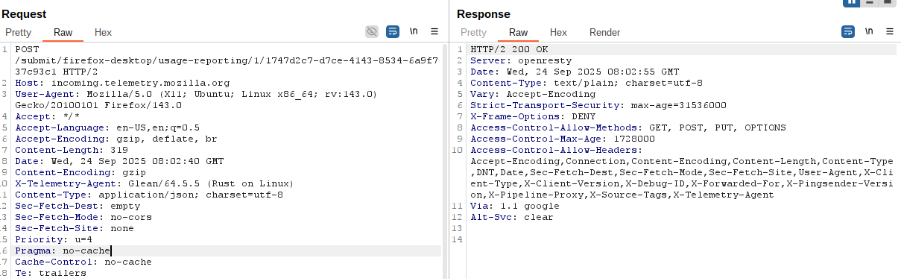
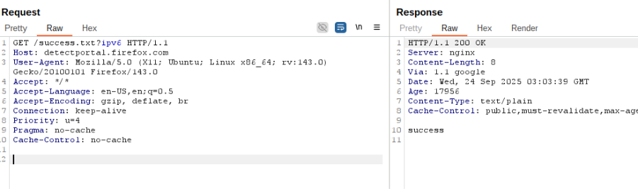
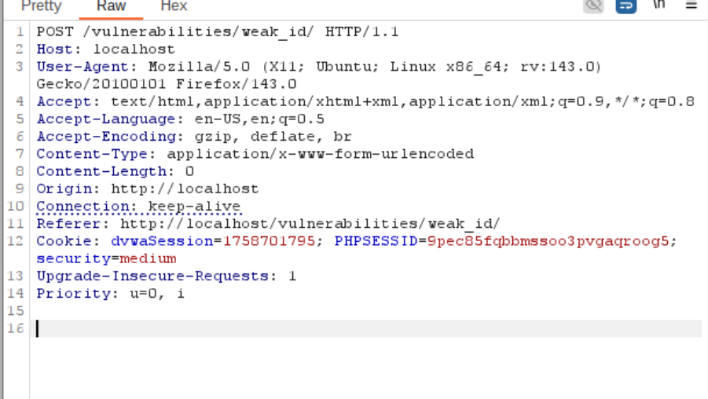
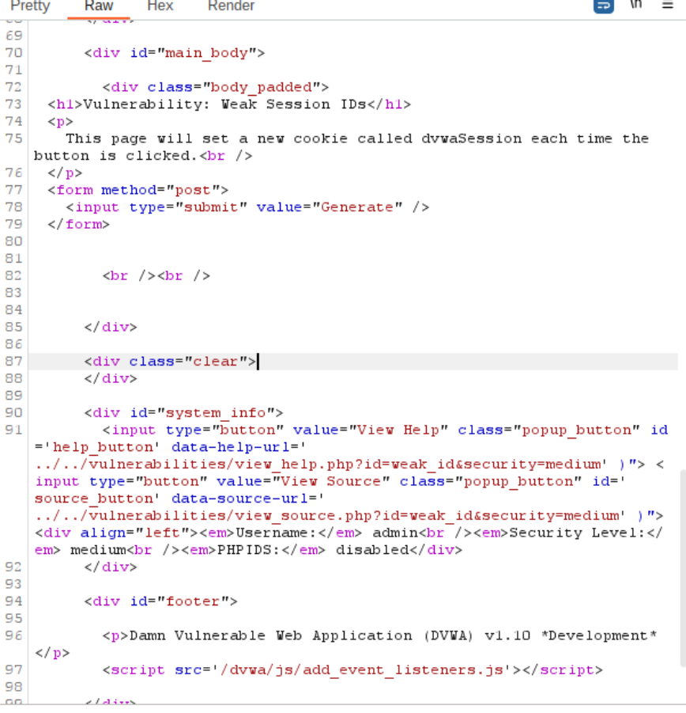
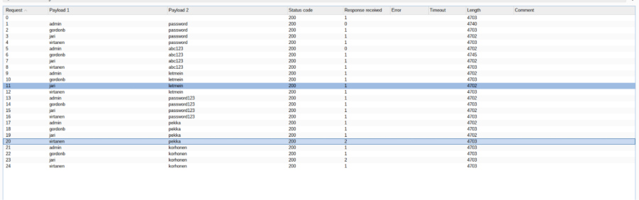
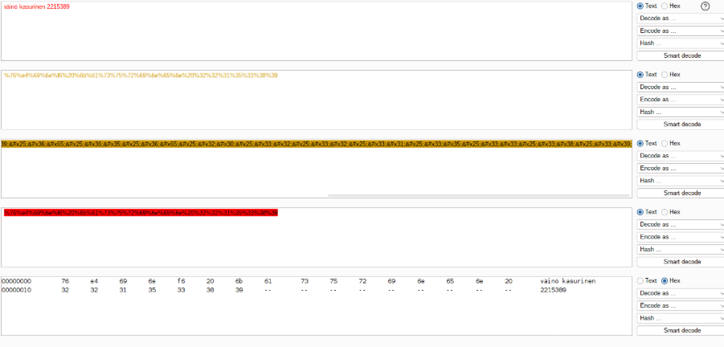
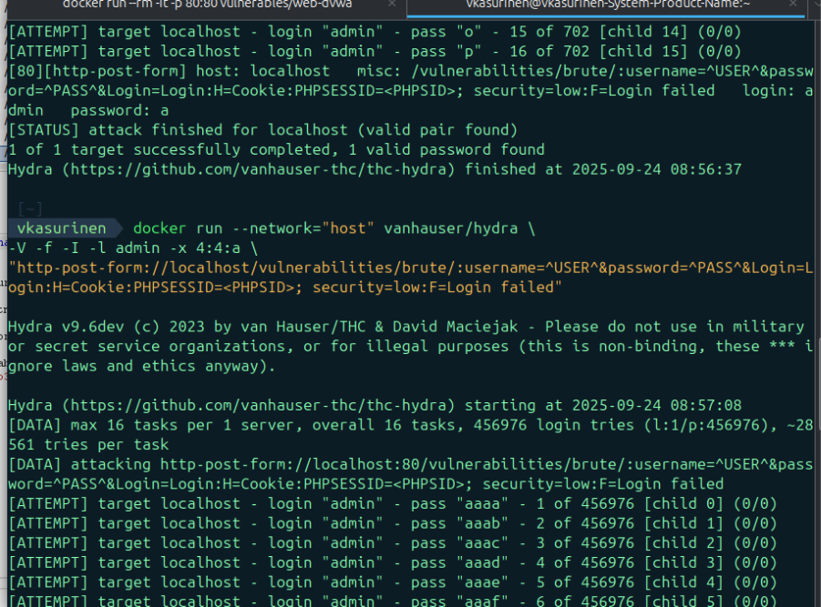
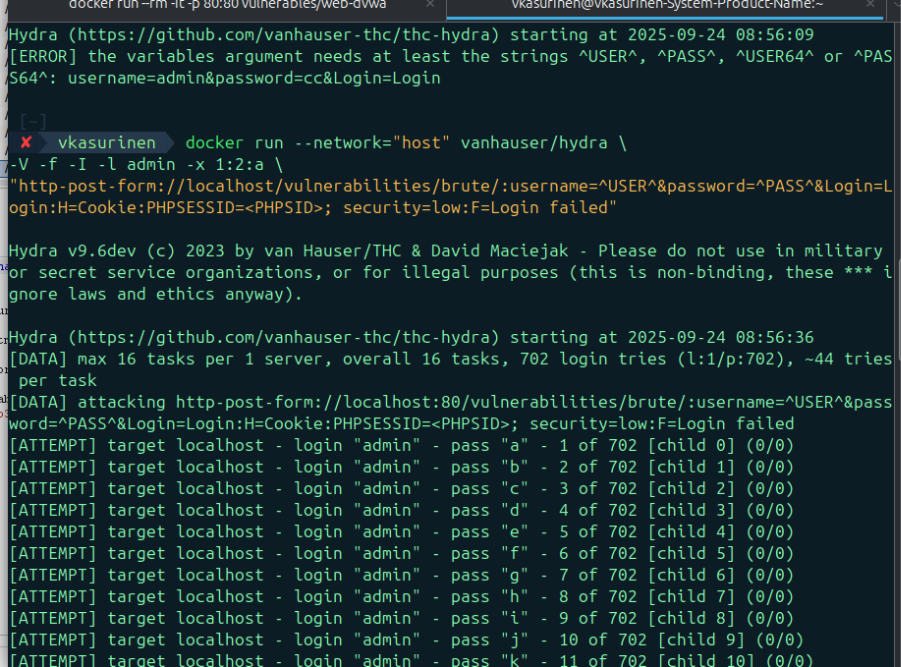

# Week 4 exercises

## Task 1: Side-channels 

Brief explanation of what side-channel the attack uses and how 

The attack is based on the fact that a device, such as a computer, consumes slightly different amounts of electricity depending on what calculation it is performing. By measuring the power consumption during many cryptographic operations, an attacker can analyze the small differences and deduce the key bits used in the calculation. 

What systems does it affect? 

 This attack particularly affects any embedded system that executes cryptographic algorithms without additional protections. On standard desktops or servers, the attack is more difficult to implement because measuring power consumption is not as straightforward. 

What information is leaked via the side channel? 

Leaks bits of secret cryptographic keys, such as the RSA private key or the AES encryption key, allowing direct message decryption or signature forgery. 

Is there a documented case of it being used in a real life attack? 

Yes. A well-known case is from the late 1990s, when Paul Kocher and colleagues introduced DPA attacks against smart cards. Many payment cards and satellite television systems were targeted, and the attackers were able to reveal the encryption keys by analyzing power consumption. 

Has it been fixed? If yes, how it was fixed? 

Yes, several defenses have been implemented: 

Cryptographic calculations are hashed using random variables, so that power consumption no longer directly reveals the key bits. 

Circuits are also being designed that always consume the same amount of power regardless of the calculation. 

https://en.wikipedia.org/wiki/Side-channel_attack 

---

## Task 2: Slow Loris 

How does it work?  

Slowloris exploits HTTP/TCP connection management, meaning the attacker opens a large number of TCP connections to the target server and intentionally sends very slow or partial HTTP requests, e.g. sending headers slowly, to keep the connection open. As a result, the server is forced to wait for requests before releasing resources, and when many users' connections are kept open, the server runs out of resources at some point and is no longer able to serve real users. 

 

Why is it unique while compared to the other high bandwith DDoS attacks?  

What is unique about this attack is that it requires very few resources to implement, but it has a really big impact. It does not rely on massive amounts of traffic like traditional botned DDOS attacks. Since the connections are technically valid TCP connections and partial HTTP requests, for example, IP-level firewall rules or SYN cookie responses alone do not always prevent the attack effectively. 

 

What are the effects of the attack?  

The server's maximum number of simultaneous connections is reached and then the server does not respond to new users. The attack is also often difficult to detect automatically because the traffic initially looks like genuine valid TCP handshakes, real requests, just slow. 

 

How can you mitigate/prevent the effects of the attack?  

Implement request timeouts, i.e. limit how long parts of a request can be received. Limit the number of simultaneous connections per client IP, set shorter timeouts for long-running request chains, use throttling rules or connection rate limiting policies. Monitor for an unusually large number of opened but incomplete HTTP requests and set an automatic response, e.g., terminate connections or block IP ranges. 

Are there any notable instances of this style of attack being performed? 

 

The Slowloris-type attack became widely known when Robert “RSnake” Hansen published the original tool and explanation (2009). 

Since then, several cases have been observed where slow HTTP connection attacks implemented with low upload capacity have crashed Apache servers, especially those running on outdated configurations. Because of this, many servers began to implement timeout and other protection mechanisms against this, and they helped prevent these attacks. 

https://en.wikipedia.org/wiki/Slowloris_(cyber_attack) 

https://www.cloudflare.com/learning/ddos/ddos-attack-tools/slowloris/  

https://www.cloudns.net/blog/the-slowloris-attack-how-it-works-and-how-to-protect-your-website/  

---

## Task 3: BurpSuite Introduction

### Subtask 1: Intercepting (0.25p)

### Subtask 2: Repeater (0.25p)

New cookie = server-generated weak ID 

Every request triggers a new value 

This demonstrates the “weak session ID” vulnerability, because they are predictable or easy to guess. 

### Subtask 3: Intruder (0.25p)

At least gordonb and abc123 are correct and can be used to log in. I went through the responses the server returned and used control + f to find all responses that said "incorrect" and it didn't, so I concluded that this combination had returned a positive response. 

### Subtask 4: Decoder (0.25p)

### Subtask 5: thc-hydra (1p)

Start time: 2025-09-24 08:58:52 

Finish time: 2025-09-24 08:58:53 

 

Output:  

[80][http-post-form] host: localhost ... login: admin   password: aaal 

[STATUS] attack finished for localhost (valid pair found) 

Hydra finished at 2025-09-24 08:58:53 
