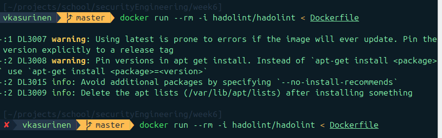
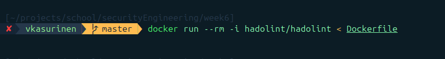
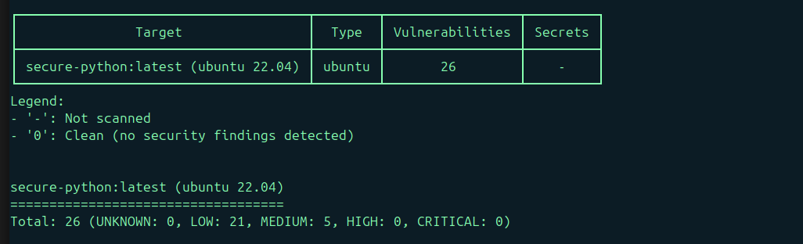
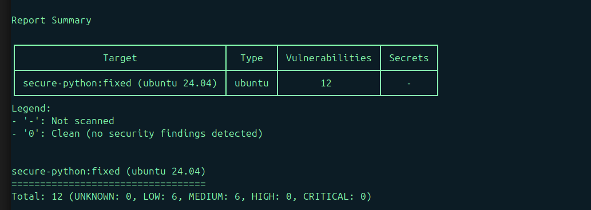

## Task 1: Secure Running Environment?

Virtualization uses hytpervisor to create multiple isolated virtual machines (VMs) on a single physical host. Each VM runs its own OS and applications, providing strong isolation between VMs, which limits the impact of a compromise in one VM from affecting others. Security capabilities include the ability to enforce strict access control, snapshotting for recovery, and resource isolation. 

Security limitations: Hypervisors themselves can be targets; a hypervisor compromise can expose all VMs. Virtualization adds overhead, and misconfigured network or storage settings may introduce vulnerabilities. 

 

Containers are lightweight environments that package applications and their dependencies, sharing the host OS kernel. Security comes from namespace and cgroup isolation, which limits access to host resources and separates containers from one another. Containers are efficient for scaling and consistent deployments and can enforce policies for runtime behavior and network access 

Security limitations: Since containers share the host kernel, kernel exploits can compromise all containers. Containers do not provide full OS isolation like VMs, and malicious container images or misconfigured permissions can introduce security risks 

https://en.wikipedia.org/wiki/Virtualization 

https://www.ibm.com/think/topics/virtualization 

https://www.redhat.com/en/topics/virtualization/what-is-virtualization 

https://en.wikipedia.org/wiki/Containerization_(computing) 

https://www.ibm.com/think/topics/containerization  

https://www.redhat.com/en/topics/cloud-native-apps/what-is-containerization  

## Task 3a Linting the Dockerfile 0.5p:
Used hadolint

docker run --rm -i hadolint/hadolint < Dockerfile

Before fixes:

FROM ubuntu:latest
RUN apt-get update && apt-get install -y python3
CMD ["python3"]

After fixes:

FROM ubuntu:22.04

RUN apt-get update && \
    apt-get install -y --no-install-recommends python3=3.10.12-1~22.04 && \
    rm -rf /var/lib/apt/lists/*

CMD ["python3"]

## Task 3b Container Image Analysis 0.5p:

I used this command to run: docker run --rm -v /var/run/docker.sock:/var/run/docker.sock aquasec/trivy image secure-python:latest

The Dockerfile includes all the necessary info to this task

Screenshots:

Before fixes:

After fixes:

## Task 3c Runtime Security 1p:

Falco
Version: 0.41.3 (x86_64)

### Spawn a shell
docker run -it ubuntu:latest /bin/sh

### alerts created:

THESE ARE ALSO IN falco_alerts.md if you want to look from there

2025-10-06T14:34:30.623982889+0000: Notice A shell was spawned in a container with an attached terminal | evt_type=execve user=root user_uid=0 user_loginuid=-1 process=sh proc_exepath=/usr/bin/dash parent=containerd-shim command=sh terminal=34816 exe_flags=EXE_WRITABLE|EXE_LOWER_LAYER container_id=d11ca4321185 container_name=hardcore_booth container_image_repository=ubuntu container_image_tag=latest k8s_pod_name=<NA> k8s_ns_name=<NA>
2025-10-06T14:34:45.235910465+0000: Critical Executing binary not part of base image | proc_exe=openssl proc_sname=dpkg gparent=ca-certificates proc_exe_ino_ctime=1759761282421632858 proc_exe_ino_mtime=3569093304029011968 proc_exe_ino_ctime_duration_proc_start=2814210097 proc_cwd=/etc/ssl/certs/ container_start_ts=1759761269712950519 evt_type=execve user=root user_uid=0 user_loginuid=-1 process=openssl proc_exepath=/usr/bin/openssl parent=update-ca-certi command=openssl rehash . terminal=34817 exe_flags=EXE_WRITABLE|EXE_UPPER_LAYER container_id=d11ca4321185 container_name=hardcore_booth container_image_repository=ubuntu container_image_tag=latest k8s_pod_name=<NA> k8s_ns_name=<NA>
^C2025-10-06T14:35:02+0000: SIGINT received, exiting...
Syscall event drop monitoring:
   - event drop detected: 0 occurrences
   - num times actions taken: 0
Events detected: 2
Rule counts by severity:
   CRITICAL: 1
   NOTICE: 1
Triggered rules by rule name:
   Terminal shell in container: 1
   Drop and execute new binary in container: 1

### Inside container:
apt update
apt install -y curl             # Installing new software
chmod 777 /etc/passwd           # Modifying sensitive system file
openssl version                 # Running a binary not part of base image
exit

### run a privileged container
docker run --privileged -it ubuntu:latest /bin/sh

